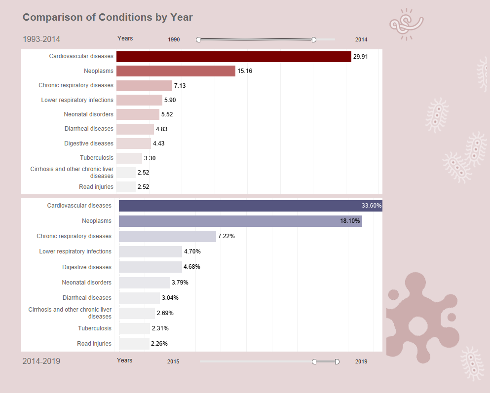

# Final-Project-Tableau

## Project/Goals
The objectives of this project were to explore and analyze the 'Causes of Death' dataset to create meaningful visual representations and effectively communicate insights obtained from the data.

## Process
### **Step 1:** 

To enhance my comprehension of the dataset and improve its utility, I initially incorporated a second dataset containing population information for each country within the relevant years.

### **Step 2:**

With further exploration of the data, I created various visualizations while documenting any interesting patterns, outliers and anomlies.

Some visualizations included maps comparing population, mortality rate and the leading causes of deaths per country, bar charts comparing the number of deaths per year for different time periods and projections for the possible number of deaths by disease per country.

### **Step 3:** 

Utilized my vizualizations in order to create dashboards that effectively convey the findings and insights uncovered during my analysis.

## Results

### **Option 2: Causes of Death**

After thoroughly exploring the aformentioned dataset, it was my intention to investigate the leading causes of death and their variations by geographical location and year.

My initial assessments involved viewing how the total number of deaths varied by continents and countries. It was apparant that more data would be required to dicsern the patterns that I was interested in. Upon acquiring a dataset containing population information, I was able to conduct a more precise analysis by calculating the mortality rates for individual countries. As deomnstrated in Dashboard 1, the countries with the highest mortality rates were Bulgaria, Lesotho, and Monaco.

I then proceeded to rank the leading causes of death globally and within individual countries, as illustrated in Dashboards 2 and 3. Among the included countries, 75% of them ranked cardiovascular diseases as the number 1 cause of death. This category includes conditions affecting the heart and/or blood vessels, such as coronary artery disease, cerebrovascular disease and heart failure, to name a few. Cancer ranked second, followed by chronic respiratory diseases in third place such as COPD and cystic fibrosis, and lower respiratory infections like pneumonia in fourth place.  Dashboard #3 reveals that the ranking of these top four causes remained consistent over the first 24 years compared to the last 5 years of the data, despite the fluctuations in the actual numbers. Cancer deaths increased by approximately 3%, digestive diseases moved up to fifth place, and neonatal and diarrheal diseases declined. I'm curious about how the inclusion of more recent years in the dataset would reveal the impact of Covid.

I then explored the trends of the different causes over the years, both by country and projected future deaths. When examining the global trends of the leading causes of death, cardiovascular diseases, cancer, and chronic respiratory diseases continued to show an upward trajectory and were expected to persist. Other notable trends include an increase in deaths related to alzheimers, dementias and Parkinsons, likely due to the aging population. Conversely, there were significant decreases in conditions such as diarrheal diseases, nutritional deficiencies and meningitis attributed in part to advancements in healthcare, the availablility of vaccines, and increased education and awareness regarding nutrition, hygiene, and clean water.

## Challenges 
The biggest challenge I faced was determining the direction to take the with the reseach. Initially, the dataset seemed to lack diverse avenues for uncovering various patterns, and I was concerned that certain perspectives might be inaccurate without information on the populations of the countries. Incorporating the population dataset required additional effort to ensure compatibility with the dataset I chose, and proved to be worthwhile.

## Future Goals
Given more time I think it would have been interesting to augment the dataset with additional data for a more comprehensive analysis. breaking down the numbers by month, could have facilitated the correlation of spikes and anomalies with specific global events. Some categories also contain many different distinct medical conditions. It would have been valuable to have data segmented by these specific diseases and conditions, along with information on the age groups they affect.